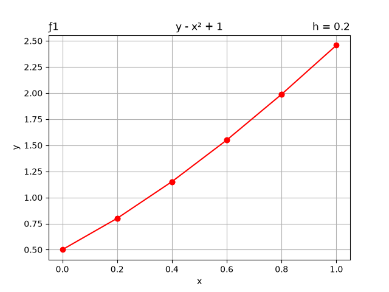

# Euler-s-Method
Euler's method for 4 functions (examples) and it's grafics

# Requeriments
Matplotlib library
```consolas
pip install matplotlib
```

# Output example
```consolas
ƒ1 | y' = y - x² + 1 , h = 0.2
        y0 -> y(0) = 0.5
        y1 -> y(0.2) = [0.5000 + 0.2(0.5 - 0² + 1)] = 0.8000
        y2 -> y(0.4) = [0.8000 + 0.2(0.8 - 0.2² + 1)] = 1.1520
        y3 -> y(0.6) = [1.1520 + 0.2(1.15 - 0.4² + 1)] = 1.5504
        y4 -> y(0.8) = [1.5504 + 0.2(1.55 - 0.6² + 1)] = 1.9885
        y5 -> y(1.0) = [1.9885 + 0.2(1.99 - 0.8² + 1)] = 2.4582
```

